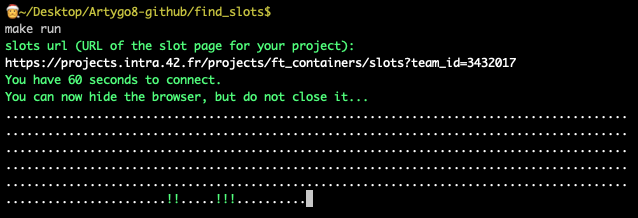

# Find slots

Small bot for checking if there are correction slots on the 42 intranet.

## Technical details

This program uses selenium to launch a Firefox browser.

It will then refresh the page every minute or so and notify with a sound when there is an available slot on the page.

It also shows progress in the terminal like so : `.....!.` where `.` means that there are no available slots and `!` means the bot found a slot on the page.

## Usage

  Set environment

  ```
  make env
  ```

  Launch

  ```
  make
  ```

  Once launched, you will get the instructions.

## Screenshot



## Current requirements

 - **python selenium**      `# main part, actual bot`
 - **python time**          `# waiting`
 - **python chime**         `# for the sound notifications`
 - **python signal**        `# for proper interruption handling`
 - **Firefox**              `# browser used by the bot`
 - **geckodriver**          `# needed by Selenium`
